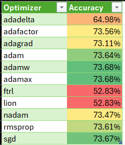

# deep-learning-challenge
Data Analytics Boot Camp Module 21

# Report

## Overview
The purpose of this analysis is to describe an effort to use deep learning to create a neural network to predict loan success, based on Alphabet Soup's data describing previous loans.

## Results

### Preprocessing (Data Cleaning)

**What variable(s) are the target(s) for your model?**: Only the IS_SUCCESSFUL variable is a target.

**What variable(s) are the features for your model?**: I treated these variables as features:
1. APPLICATION_TYPE
1. AFFILIATION
1. CLASSIFICATION
1. USE_CASE
1. ORGANIZATION
1. STATUS
1. INCOME_AMT
1. ASK_AMT

**What variable(s) should be removed from the input data because they are neither targets nor features?**: I removed SPECIAL_CONSIDERATIONS because there are very few "special" loans, and it seems likely that each special consideration is distinct and not captured in the data. Dropping it seemed to improve accuracy.

Note EIN and NAME were already removed as prescribed by the Challenge.

In addition to the cleanup prescribed in the Challenge and mentioned above, I made these changes to the data:

Allowing More Categories: I reduced the cutoff for values_counts() values for both APPLICATION_TYPE and CLASSIFICATION, allowing more categories of each. This improved accuracy.

Adding New Columns:
1. INCOME_MID: This is derived from the INCOME_AMT column, converting it from categorical to numeric. It did not help.
1. INCOME_ASK_RATIO: The ratio of INCOME_MID to ASK_AMT. It did not help.

### Compiling, Training, and Evaluating the Model

The final neural network contained 5 dense layers total:
1. 41 neurons with "gelu" activation
1. 41 neurons with "mish" activation
1. 41 neurons with "relu6" activation
1. 41 neurons with "tanh" activation
1. 1 neuron with "sigmoid" activation -- the output layer

Note the activations were selected based one some Keras Tuner runs, but very similar results were attained with other activations. I do not actually know what the activations means and cannot comment on which would be more appropriate, except for "sigmoid" which is explicitly meant to indicate the probability of matching 1 of 2 possible targets.

I was not able to reach the target 75% accuracy; I reached only 73.5% accuracy. I actually reached near this accuracy fairly quickly, mainly by using a nontrivial network (layers with various activiations and 30+ units each) and allowing more Application Types and Classifications to be categorized as described above.

This is the list of what I tried for the model itself:

**Re-Splitting**:
Subjectively, the accuracy seemed "stuck" at 73.4% for a while and I wondered if my train_test_split() call happened to produce imbalanced training and test sets. I tried several other seed values without significantly impacting accuracy, effectively proving myself wrong.

I also added code to show the values_counts() for each solumn in the final training and test sets, to get a rough estimate of whether the split was good.

**Hyperband Tuning**:
I used Keras Tuner to iterate through a variety of network compositions. I did not have the resources to run through a huge number of combinations, but varying number of layers, units per layer, and activation, I got a sense of what helped. I settled on gelu, tanh, relu6, mish, and silu as the most useful activations, with at least 3 layers of at least 10 units each.

Though tuning suggested those solutions, it also showed a very persistent tendency to settle at about 73.0% - 73.4% accuracy with many combinations of network sizes and activations. This suggests that merely changing the network composition will not get past that threshold.

**Many Neural Network Configurations**:
I will not attempt to describe the variety of network compositions I tried. There were a lot. The final configuration is described above.

**Saving the Best Model**:
The challenge instructions say to save every 5 epochs, but I found it more helpful to only save a model if it has better accuracy than any previous model. This allowed me to make adjustments (like metrics and optimizers discussed below) to try to nudge the performance higher.

**Multiple Accuracy Metrics**:
Noting that fit() takes multiple accuracy metrics and combines them, I tried including three major accuracy metrics to maximize: Accuracy, F1Score, and AUC (Area Under Curve). This may have slightly improved the final result by detecting small improvements, but I suspect that in this case (basically binary classification) all the metrics are functionally equivalent.

**Different Optimizers**:
Since I don't really understand what optimizers do or how to pick one over another, I looped through them all, creating a fresh network and training it with the optimizer. I did not record the exact data and network configurations, but these are the accuracy values I got:

After that experiment, I mostly used the adam and sgd optimizers.

I also tried alternating between optimizers in a loop, training incrementally. Accuracy did not get much past 46%, which is less than random chance, which suggests that this was a bad idea.

**Adjusting Learning Rate**:
Optimizers can take a Learning Rate, which more-or-less controls how big a change to make, so I tried training incrementally while varying learning rate. I hoped to get the training algorithm to "jump" past whatever caused it to top out below 74% accuracy, or to slowly improve from there. I don't think it helped.

## Summary

### Overall
The model, saved as AlphabetSoupCharity_Optimization.h5 and AlphabetSoupCharity_Optimization.keras is 73.5% accurate. This doesn't seem very helpful since about half of loans are successful anyway, so the model isn't much better than a coin flip. I do not recommend relying on this model.

### How to Improve the Model:
Trying different metrics, optimizers, and learning rates through Keras Tuner might produce better results than my hard-coded approach. But I suspect that my overall approach simply will not reach 75% with a fair train/test split. It may require different layer types or deeper customization of the dense layers and activations.
